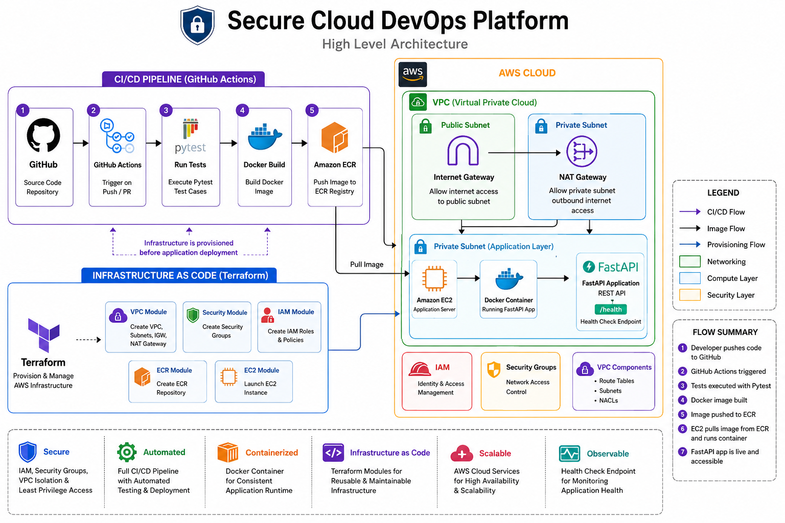
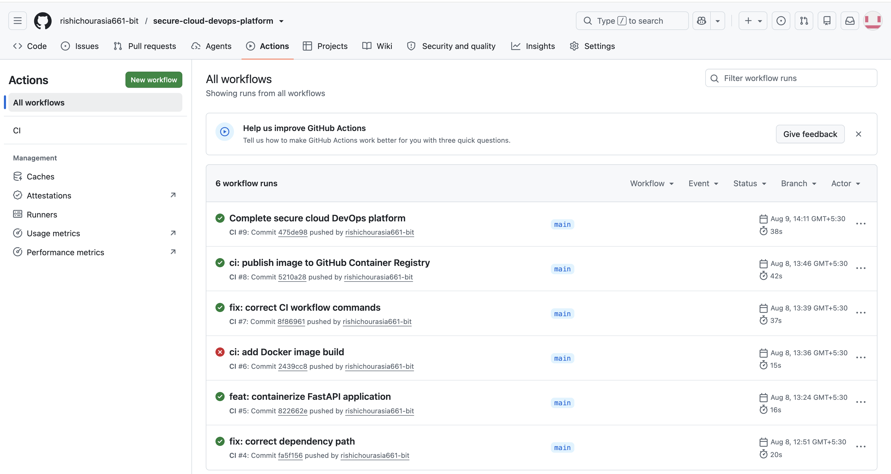
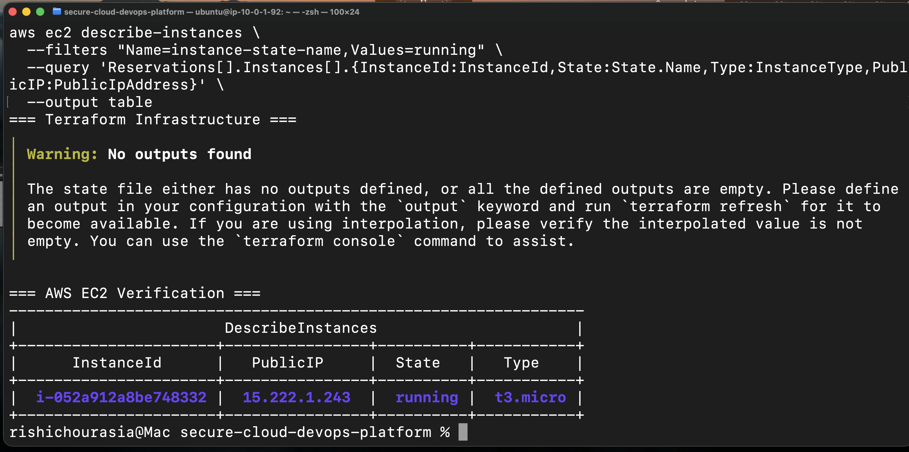
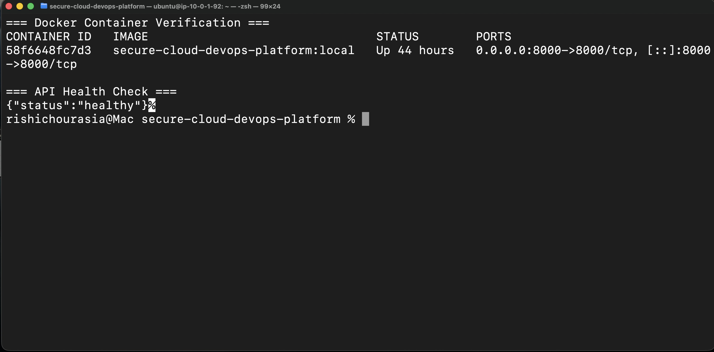
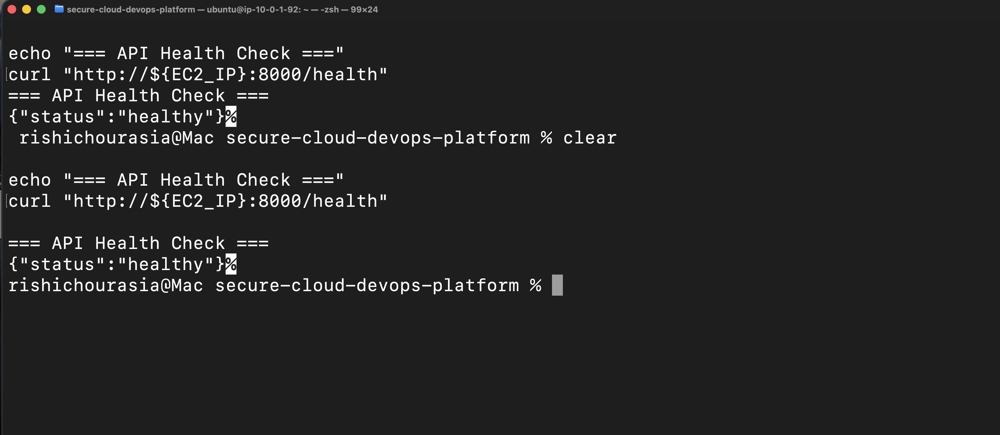

# Secure Cloud DevOps Platform

A containerized FastAPI application deployed on AWS using Terraform, Docker, Amazon ECR, and Amazon EC2.
## Project Overview

Secure Cloud DevOps Platform is a focused DevOps project that provisions AWS infrastructure with Terraform and deploys a containerized FastAPI application using Docker, Amazon ECR, and Amazon EC2.

  ### Platform Structure

```text
                         Developer
                             │
                          git push
                             ▼
                         GitHub
                             │
                             ▼
                    GitHub Actions
                             │
                 ┌───────────┼───────────┐
                 │           │           │
                 ▼           ▼           ▼
               Test       Validate      Build
                                         │
                                         ▼
                                      Docker
                                         │
                                         ▼
                                    Amazon ECR
                                         │
                                         ▼
                                    Amazon EC2
                                         │
                                         ▼
                                      FastAPI
                                         │
                                         ▼
                                     /health
```

Deployment Flow

Code → Docker → ECR → EC2 → FastAPI

Terraform provisions the VPC, subnets, routing, security, IAM, ECR, and EC2 infrastructure, creating a reproducible foundation for the application.

## Project Objective

 Project Objective

Build a secure and reproducible AWS deployment workflow using Terraform, Docker, ECR, and EC2, demonstrating core DevOps practices from infrastructure provisioning to containerized application deployment.


## Features

| Capability | Description |
|---|---|
| **Automated Testing** | FastAPI application tested with Pytest |
| **CI Automation** | GitHub Actions automatically runs the test pipeline |
| **Containerization** | Application packaged into a Docker image |
| **Health Verification** | `/health` endpoint used for application health checks |
| **Security-Oriented Infrastructure** | Terraform-managed AWS infrastructure with IAM and network security controls |
| **Environment Separation** | Separate staging and production infrastructure configurations |
| **Infrastructure as Code** | AWS infrastructure managed through reusable Terraform modules |
| **Modular Project Structure** | Application, tests, infrastructure, scripts, and workflows organized into dedicated components |


## Architecture

The platform follows a Git-based delivery workflow:

Developer → GitHub → GitHub Actions → Security Checks → Docker → GHCR → AWS Staging → Production




## Project Structure

```text
secure-cloud-devops-platform/
│
├── .github/
│   └── workflows/
│       ├── ci.yml
│       └── deploy.yml
│
├── app/
│   ├── src/
│   │   ├── main.py
│   │   └── __init__.py
│   │
│   └── tests/
│       ├── test_api.py
│       └── __init__.py
│
├── infrastructure/
│   └── terraform/
│       ├── modules/
│       │   ├── vpc/
│       │   ├── security/
│       │   ├── iam/
│       │   ├── ecr/
│       │   └── ec2/
│       │
│       └── environments/
│           ├── staging/
│           └── production/
│
├── scripts/
│   ├── build.sh
│   ├── deploy.sh
│   └── cleanup.sh
│
├── docs/
│   ├── architecture/
│   │   └── project-architecture.png
│   ├── deployment.md
│   ├── security.md
│   └── infrastructure.md
│
├── Dockerfile
├── requirements.txt
├── .dockerignore
├── .gitignore
├── Makefile
├── LICENSE
└── README.md
```

##  Technology Stack

| Category                | Technologies                           |
| ----------------------- | -------------------------------------- |
|   **Cloud**            | AWS · VPC · EC2 · ECR · IAM            |
|   **Infrastructure**  | Terraform · Terraform Modules          |
|   **CI/CD**            | GitHub Actions                         |
|   **Version Control**  | Git · GitHub                           |
|   **Containerization** | Docker                                 |
|   **Application**      | Python · FastAPI                       |
|   **Testing**          | Pytest · FastAPI TestClient            |
|   **Automation**       | Bash                                   |
|   **Security**         | IAM · Security Groups · GitHub Secrets |


### Key Capabilities

- Containerized Python API
- Automated CI/CD
- Infrastructure as Code
- Secure GitHub-to-AWS authentication
- Automated security checks
- Staging and production environments
- Application health monitoring
- Infrastructure and deployment troubleshooting


## 🔄 CI/CD Workflow

```text
                        Developer
                              │
                           git push
                              ▼
                  ┌──────────────────────┐
                  │        GitHub        │
                  │   Source Repository  │
                  └──────────┬───────────┘
                             │
                          Trigger
                             ▼
                  ┌──────────────────────┐
                  │     GitHub Actions   │
                  │     CI/CD Pipeline   │
                  └──────────┬───────────┘
                             │
                             ▼
                  ┌──────────────────────┐
                  │     Checkout Code   │
                  │   Retrieve Source    │
                  └──────────┬───────────┘
                             │
                             ▼
                  ┌──────────────────────┐
                  │        Pytest       │
                  │  Automated Testing   │
                  └──────────┬───────────┘
                             │
                       Tests Pass?
                        /          \
                      ❌            ✅
                      │              │
                      ▼              ▼
                 ┌─────────┐  ┌──────────────────────┐
                 │ Pipeline│  │     Docker Build    │
                 │  Stops  │  │   Container Image    │
                 └─────────┘  └──────────┬───────────┘
                                          │
                                         ▼
                              ┌──────────────────────┐
                              │      Amazon ECR     │
                              │   Container Registry  │
                              └──────────┬───────────┘
                                         │
                                      Pull Image
                                         ▼
                              ┌──────────────────────┐
                              │      Amazon EC2     │
                              │     Docker Runtime    │
                              └──────────┬───────────┘
                                         │
                                         ▼
                              ┌──────────────────────┐
                              │      FastAPI        │
                              │     Application      │
                              └──────────┬───────────┘
                                         │
                                         ▼
                              ┌──────────────────────┐
                              │       /health      │
                              │  Health Verification │
                              └──────────────────────┘
```


## AWS and Terraform workflow


Infrastructure is provisioned using Terraform with reusable modules and
separate staging and production environments.

```text
                      Terraform
                         │
                         ▼
              ┌─────────────────────┐
              │ Environment Config  │
              │                     │
              │ Staging / Production│
              └──────────┬──────────┘
                         │
                         ▼
              ┌─────────────────────┐
              │   Terraform Modules │
              └──────────┬──────────┘
                         │
          ┌──────────────┼──────────────┐
          │              │              │
          ▼              ▼              ▼
         VPC           Security        IAM
          │              │              │
          └──────────────┼──────────────┘
                         │
              ┌──────────┴──────────┐
              │                     │
              ▼                     ▼
            Amazon ECR            Amazon EC2
          Container Registry     Application Host
```

### Terraform Modules

- **VPC** — network and subnet configuration
- **Security** — security groups and network controls
- **IAM** — roles and permissions
- **ECR** — private container registry
- **EC2** — application compute infrastructure

### Environment Separation

```text
infrastructure/terraform/
│
├── modules/
│   ├── vpc/
│   ├── security/
│   ├── iam/
│   ├── ecr/
│   └── ec2/
│
└── environments/
    ├── staging/
    └── production/
```  
----       │
## Secure Cloud DevOps Platform

Security is implemented as a defense-in-depth architecture, applying controls across the source-code, CI/CD, container, identity, network, and AWS infrastructure layers.


# Security Architecture
Key controls include:

  IAM — Controlled AWS permissions and role-based access
  Security Groups — Restricted network access to required ports
  GitHub Secrets — Sensitive deployment credentials kept outside source code
  Network Segmentation — Public and private subnet architecture
  Amazon ECR — Centralized container image management
  Container Security — Dockerized application with controlled runtime configuration


##  Testing & Validation Structure

The platform uses automated testing and validation at both the application and infrastructure layers to ensure changes are validated before deployment.


The platform validates application code, containerization, and infrastructure before deployment.

```text
                     Source Code
                          │
                          ▼
                   ┌─────────────┐
                   │    Pytest   │
                   │ Application │
                   │    Tests    │
                   └──────┬──────┘
                          │
                      Tests Pass?
                       /       \
                     No         Yes
                     │           │
                     ▼           ▼
                  ┌──────┐  ┌─────────────┐
                  │ Stop │  │ Docker Build│
                  └──────┘  └──────┬──────┘
                                   │
                                   ▼
                            ┌─────────────┐
                            │  Container  │
                            └──────┬──────┘
                                   │
                                   ▼
                            ┌─────────────┐
                            │   /health   │
                            │ Health Check│
                            └──────┬──────┘
                                   │
                                   ▼
                         ┌──────────────────┐
                         │ Terraform        │
                         │ Validate         │
                         └────────┬─────────┘
                                  │
                                  ▼
                         ┌──────────────────┐
                         │ Terraform Plan   │
                         └────────┬─────────┘
                                  │
                                  ▼
                              AWS Deploy
```

  ## Deployment Workflow

The application follows an automated deployment path from source control to the AWS runtime environment.

```text
                         Developer
                             │
                          git push
                             ▼
                    ┌─────────────────┐
                    │     GitHub      │
                    │ Source Control  │
                    └────────┬────────┘
                             │
                             ▼
                    ┌─────────────────┐
                    │ GitHub Actions  │
                    │    CI / CD      │
                    └────────┬────────┘
                             │
                             ▼
                    ┌─────────────────┐
                    │ Test & Validate │
                    │     Pytest      │
                    └────────┬────────┘
                             │
                             ▼
                    ┌─────────────────┐
                    │  Docker Build   │
                    │ Container Image │
                    └────────┬────────┘
                             │
                             ▼
                    ┌─────────────────┐
                    │   Amazon ECR    │
                    │ Image Registry  │
                    └────────┬────────┘
                             │
                         Pull Image
                             ▼
                    ┌─────────────────┐
                    │   Amazon EC2    │
                    │ Docker Runtime  │
                    └────────┬────────┘
                             │
                             ▼
                    ┌─────────────────┐
                    │ FastAPI         │
                    │   Container     │
                    └────────┬────────┘
                             │
                             ▼
                    ┌─────────────────┐
                    │    /health      │
                    │ Health Check    │
                    └─────────────────┘
```


| Stage        | Tool              | Purpose             |
| ------------ | ----------------- | ------------------- |
| Source       |   GitHub         | Version control     |
| CI/CD        |   GitHub Actions | Automate deployment |
| Validation   |   Pytest         | Verify application  |
| Build        |   Docker         | Package application |
| Registry     |   Amazon ECR     | Store image         |
| Runtime      |   EC2           | Run container       |
| Verification |   `/health`      | Confirm deployment  |

**Infrastructure:** AWS resources are provisioned separately using **Terraform**.

##  Results & Verification

The platform was validated across the application, container, and infrastructure layers.


| Check | Validation Result |
|---|---|
|   **Pytest** | ✅ Tests Passed |
|   **Terraform Validate** | ✅ Configuration Valid |
|   **Docker Build** | ✅ Image Built Successfully |
|   **Docker Container** | ✅ Container Running |
|   **API Health Check** | ✅ `{"status":"healthy"}` |
|   **GitHub Actions** | ✅ CI Workflow Successful |

 
  Application Verification
curl http://localhost:8000/health
{
  "status": "healthy"
}

  Infrastructure Verification
terraform validate
Success! The configuration is valid.










##   Future Improvements

-   **Kubernetes / EKS** — Introduce container orchestration and scalable workloads.
-   **DevSecOps** — Add automated security and vulnerability scanning to CI/CD.
-   **Observability** — Implement Prometheus, Grafana, and centralized logging.
-   **GitOps** — Adopt Argo CD for automated Kubernetes deployments.
-   **High Availability** — Add load balancing, auto scaling, HTTPS, and multi-AZ infrastructure.

##   Author

**Rishi Chourasia**  
Cloud & DevOps Engineer | AWS | Terraform | Docker | Kubernetes | CI/CD